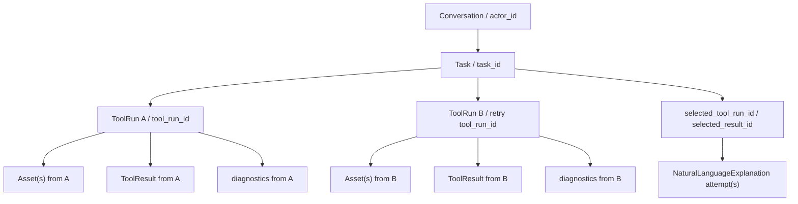
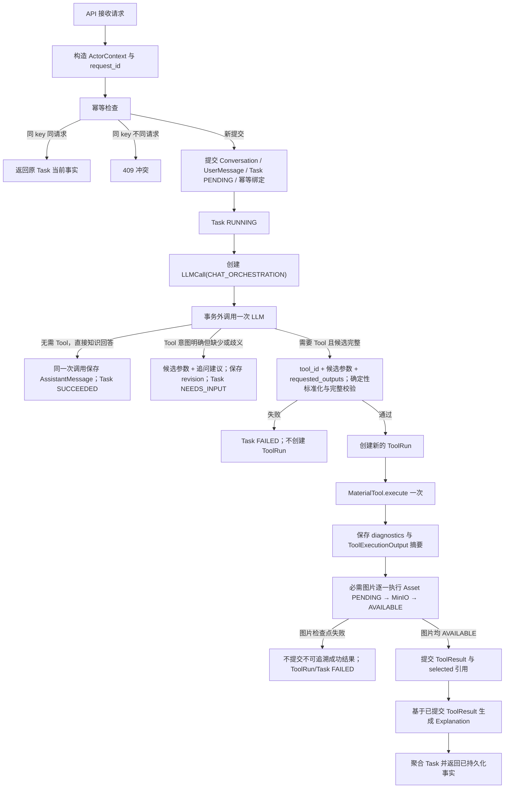
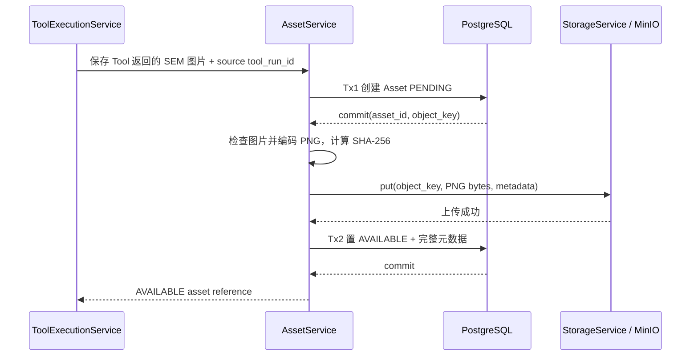

# 材料智能体平台阶段 0 第二节：端到端数据流、状态迁移与持久化边界

> 状态：已确认设计基线
>
> 修订日期：2026-07-16
>
> 前置文档：`2026-07-13-sem-mvp-stage-0-architecture-design.md`（已确认设计基线）
>
> 事实依据：本轮重新检查当前仓库并完整读取第一节、第二节和第三节最新文档；第二节架构与产品行为保持不变，仅同步普通知识问答、Tool 路由和追问默认由一次 `CHAT_ORCHESTRATION` LLMCall 完成。未修改或运行 `SEM/`，未导入模型、未加载权重、未安装依赖，也未执行训练或推理。

## 项目负责人审阅层

本节要说明的是：用户发出请求后，系统如何一路处理到最终返回，以及在缺参数、执行失败、图片保存失败或解释失败时，平台怎样保留清楚、可追溯的事实。项目负责人不需要关注数据库实现语法，只需确认下面的产品行为符合预期。

### 1. 用户请求进入系统后的主要流程

系统先保存用户消息和任务，再判断这是普通知识问答，还是需要调用 `zta35g_sem_virtual_lab`。如果是知识问答，系统直接形成助手回答；如果需要 Tool，系统先整理候选参数并做确定性校验，只有输入完整合法时才真正执行 Tool。Tool 返回后，平台先保存必须保留的图片，再保存结构化结果，最后基于结构化结果生成自然语言解释。

### 2. `NEEDS_INPUT` 与直接失败

当系统已经判断用户要使用 Tool，但缺少参数、缺少明确单位，或存在不能安全消解的歧义时，Task 进入 `NEEDS_INPUT`。此时不会执行 Tool，系统保存当前输入快照并向用户追问；用户补充后继续使用同一个 Task，重新对完整输入做校验。

如果输入已经完整，但材料不支持、精度或单位非法、参数越界、请求输出非法，则直接失败，不进入 `NEEDS_INPUT`。Tool 或 Runtime 不可用、SEM 生成失败、必需图片无法保存、结构化结果无法提交，也属于执行或持久化失败。HTTP/JSON 包络本身无法解析时，可以在创建 Task 前直接拒绝。

### 3. 三种 Tool 请求模式

MVP 只有三种模式：

1. 只请求 `sem_image`：生成并返回一张 SEM 图片，不执行性能预测。
2. 只请求 `mechanical_properties`：Tool 内部仍先生成 SEM，再完成性能预测；平台保留这张中间 SEM，保证性能结果可追溯。
3. 同时请求两项：只生成一张 SEM，并复用同一张图片完成性能预测，避免同一任务出现两张来源不同的图片。

### 4. 成功、部分成功与失败

- 成功：用户请求的输出均已完成，必需图片和结构化结果均已可靠保存，必要解释也已完成。
- 部分成功：至少有一项用户请求输出可用，或者结构化 ToolResult 已成功但自然语言解释失败。可用结果仍然返回，失败部分明确说明。
- 失败：没有用户请求输出可用，或必需图片、结构化结果等关键事实无法可靠保存。只请求性能时，即使中间 SEM 已保存，但性能失败，用户目标仍算失败。

### 5. Tool 重试不会覆盖旧结果

整体 Tool 重试沿用同一个 Task，但每次创建新的 ToolRun。旧 ToolRun、旧图片、旧结构化结果、旧错误和 diagnostics 均保留且不覆盖。新尝试产生自己的图片和性能结果；Task 只通过明确的 selected 引用选择当前采用哪一次结果，不能按“最新一次”猜测，也不能把不同尝试的图片和性能拼在一起。

### 6. 图片为什么采用 `PENDING → MinIO → AVAILABLE`

图片本体保存在 MinIO，但平台需要先有一个稳定的图片记录，才能知道上传失败、上传成功但状态未更新，或对象与记录不一致时应该恢复哪一项。因此先建立 `PENDING` 锚点，再上传 MinIO，最后确认 `AVAILABLE`。只有 `AVAILABLE` 图片才能进入成功结果。失败时可以落到 `FAILED` 或 `ORPHANED`，避免出现“界面说成功，但图片实际找不到”的情况。

### 7. Explanation 失败不影响结构化结果

ToolResult 是正式结构化事实，NaturalLanguageExplanation 是对它的后续说明。解释只能读取已经保存的 ToolResult。解释失败不会把已成功的图片、性能数据或 ToolRun 改成失败；平台返回结构化结果和解释错误，后续只重试 Explanation，不重新执行 Tool，也不覆盖旧解释尝试。

### 8. 如何通过结构化日志定位主要故障

结构化日志使用 `request_id`、`task_id` 和适用时的 `tool_run_id` 串联链路，并记录主要环节：请求接收、聊天编排、输入标准化、输入校验、Tool 启动、SEM 生成、性能预测、图片保存、结果保存、解释生成和响应完成。项目负责人或运维人员可以据此判断故障发生在输入、Tool/Runtime、图片、结果、解释还是最终响应，而不需要查看模型内部张量或完整 Prompt。

### 9. 对未来 Tool、登录系统和 SSE 的影响

新增 Tool 时继续复用 Task、ToolRun、Asset、ToolResult 和 Explanation，只增加新的 Tool 定义及输入输出结构，不重写现有核心关系。未来登录系统通过 Actor 所有权增加访问控制，不迁移历史结果。未来 SSE 只消费 TaskProgressReporter 提供的临时进度；断线或进度丢失不改变 PostgreSQL/MinIO 中的最终事实，也不要求现在建设事件重放系统。

### 10. 项目负责人验收重点

项目负责人只需确认：缺参数会追问而不是误执行；非法完整输入会直接失败；三种 Tool 模式符合产品预期；图片与性能结果始终可追溯到同一次 ToolRun；重试保留旧结果；图片未可靠保存时不误报性能成功；解释失败不覆盖结构化结果；日志能定位主要故障环节；未来 Tool、登录和 SSE 不要求重写当前核心流程。

## 1. 范围、非范围与本节结论

### 1.1 本节范围

本节把第一节的稳定边界连接成可实现的数据流，明确：

- 普通知识问答、`NEEDS_INPUT` 恢复和三种 ZTA35G Tool 请求模式；
- Task、ToolRun、Asset、ToolResult、NaturalLanguageExplanation 的关系和状态聚合；
- ToolExecutionOutput、diagnostics 和结果提交检查点；
- PostgreSQL/MinIO 写入顺序、失败补偿和 orphan 识别原则；
- 单张灰度 PNG 的最小持久化规则；
- ToolResult、provenance、解释和 API 响应组装；
- 幂等提交、整体 Tool 重试和解释重试；
- 结构化日志与 TaskProgressReporter 的职责区别；
- 双环境之间一次 Tool 执行的数据边界。

### 1.2 本节非范围

本节不创建或实现：

- 业务代码、FastAPI、Pydantic Schema、数据库表或 Alembic migration；
- StorageService、AssetService、Tool、Adapter、Runtime、LangChain 或前端；
- Docker Compose、PostgreSQL、MinIO、Conda 环境或依赖；
- 模型加载、推理运行、权重计算或 `SEM/` 修改；
- 定时清理器、队列、Worker、Redis、SSE、WebSocket、分布式锁或分布式事务；
- OpenTelemetry、LangSmith、Metrics、告警或 Event Store；
- 正式登录、权限、多租户、计费或模型生命周期管理；
- 阶段 1 实施计划、阶段 1A/1B 实施工作或 git commit。

### 1.3 本节关键结论

1. Application 对一个 ToolRun 只调用一次 `MaterialTool.execute(validated_input, request_context)`。
2. Tool 或其内部 Adapter 自己完成 SEM 生成和按需性能预测；平台不在两个模型阶段之间插入持久化检查点。
3. ToolExecutionOutput 尽可能一起返回图片、已成功输出、失败输出、错误和 diagnostics。
4. Application 必须先保存 Tool 返回的必需图片；图片达到 `AVAILABLE` 后，才允许提交引用图片的成功或部分成功 ToolResult。
5. 资产持久化采用 PostgreSQL `PENDING` → PNG/SHA-256 → MinIO → PostgreSQL `AVAILABLE`。
6. 每次实际 Tool 执行尝试新建 `tool_run_id`；显式重试保留 `task_id`，新建 `request_id` 和 `tool_run_id`。
7. Task 只需显式选择 `selected_tool_run_id` 和 `selected_result_id`。
8. Asset、ToolResult 和 diagnostics 直接关联实际产生它们的 `tool_run_id`。
9. PostgreSQL 结构化记录和 MinIO 文件是业务事实；日志与 ProgressReporter 都不能替代持久化事实。
10. MVP 不要求状态转换历史表、EventPublisher、TaskExecutor Port、InferenceRun、StageRun 或独立 trace_id。

## 2. 事实来源、标识和核心关系

### 2.1 持久化事实来源

最低持久化事实包括：

- Conversation、不可变 UserMessage、AssistantMessage；
- Task 当前状态、时间、错误、actor 关联和 selected 引用；
- 每一次 ToolRun 的状态、请求输出、diagnostics、时间、错误和输出摘要；
- Asset 元数据、状态、内部 object key、checksum 和来源；
- ToolResult 结构化数据、artifacts、warnings、provenance 和 error；
- NaturalLanguageExplanation 及其 LLM 调用记录；
- `task_input_revision` 快照；
- 幂等键、请求摘要和绑定的 `task_id`。

进程内对象、Runtime 内存中的 Tensor、图片 bytes、结构化日志、TaskProgressReporter 调用或前端显示状态都不能替代上述事实。

### 2.2 最小运行标识

| 标识 | 语义 |
|---|---|
| `request_id` | 一次 HTTP 请求；补充、整体重试、解释重试时新建 |
| `task_id` | 稳定业务任务；`NEEDS_INPUT` 恢复和显式整体 Tool 重试时保留 |
| `tool_run_id` | 一次实际 Tool 执行尝试；每次执行或重试均新建 |

MVP 使用这三个 ID 完成主要执行关联，不强制独立 `trace_id`。

以下仍是必要的业务或资源 ID，但不形成额外运行层级：

```text
conversation_id
actor_id
asset_id
result_id
explanation_id
```

### 2.3 `ActorContext`

```text
ActorContext
  actor_id
  user_id
```

MVP：

```text
actor_id = 稳定本地匿名主体
user_id = null
```

Conversation、Task、Asset 和 Result 允许关联 `actor_id`。不保存 `project_id`、`tenant_id`、角色矩阵、多租户路由或计费语义。

### 2.4 Task、ToolRun、Asset 与 Result



规则：

1. 每个 Asset、ToolResult 和 diagnostics 只关联一个实际来源 `tool_run_id`。
2. Task 的 selected 引用必须显式更新，不能选择“最后创建”或“最后完成”的 ToolRun。
3. 不得把 ToolRun A 的 SEM 与 ToolRun B 的性能拼成一个结果。
4. 旧 ToolRun、Asset、Result、diagnostics 和错误不可变；Task 的 selected 引用变化不改写旧事实。

### 2.5 `request_context`

Application 调用 MaterialTool 时提供：

```text
request_id
conversation_id
task_id
tool_run_id
actor_context
requested_at
```

该上下文用于日志关联、Tool Runtime 调用和安全诊断，不携带 MinIO、数据库、LangChain 或模型内部对象。

## 3. 端到端总数据流

### 3.1 总流程



### 3.2 请求创建事务

能够形成业务提交时，以下内容在同一个 PostgreSQL 本地事务中提交：

1. 创建或确认 Conversation；
2. 追加不可变 UserMessage；
3. 创建 Task，初始状态 `PENDING`；
4. 保存主体关联和请求摘要；
5. 绑定 idempotency key、request digest 与 `task_id`。

事务失败则不产生半个 Task 或孤立幂等占位。HTTP/JSON 包络本身无法解析时可以直接返回 `400/422`，不创建 Task。

### 3.3 Tool 路径顺序

```text
Task RUNNING
→ 完整确定性校验通过
→ Tool Registry 解析 tool_id / tool_version / schema_version
→ 创建新的 ToolRun PENDING
→ ToolRun RUNNING
→ 记录 tool_started 日志和可选进度
→ ZTA35GSEMVirtualLabTool.execute(validated_input, request_context)
→ 内部 Client Adapter 调用本地 ZTA35G Tool Runtime
→ Runtime 完成完整黑盒计算并返回 ToolExecutionOutput
→ 保存 ToolRun diagnostics / output_summary
→ 为必需图片创建 Asset PENDING
→ 编码 PNG、计算 SHA-256、上传 MinIO
→ Asset AVAILABLE
→ 根据 requested/completed/failed outputs 组装 ToolResult
→ 提交 ToolResult、ToolRun 终态和 Task selected 引用
→ Explanation 只读取已提交 ToolResult
→ 聚合 Task 状态
→ 返回已持久化事实
```

Application 不调用 `generate_sem` 或 `predict_mechanical_properties`，不持有跨阶段图片载荷身份，也不要求 Asset AVAILABLE 后 Runtime 才执行 DenseNet/SVR。

### 3.4 双环境调用链

```text
materialsagent-backend
→ Local ZTA35G Tool Client Adapter
→ 127.0.0.1 ZTA35G Tool Runtime
→ materialsagent-zta35g
```

`materialsagent-backend` 使用候选 Python 3.11 和较新的 FastAPI/LangChain 平台依赖；`materialsagent-zta35g` 使用 Python 3.8，并以已知的 PyTorch 1.13.1+cu116、Torchvision 0.14.1+cu116、NumPy 1.22.3、Joblib 1.4.2、Matplotlib 3.2.2 及涉及 scikit-learn 1.0.2 的原始组合为阶段 1B 验证起点。PostgreSQL/MinIO 仍由 Docker Compose 管理，前端使用独立 Node.js 环境。

Runtime 只监听本机回环地址，只接收已校验四维参数、requested outputs 和必要 request context；返回 ToolExecutionOutput。Runtime 不作为公开 API，不访问 PostgreSQL、MinIO、LangChain、前端或 Repository。模型在 Runtime 启动后加载并复用。

这个进程边界只隔离 Python 3.8 与旧 PyTorch/CUDA 依赖。Application、数据库、前端和公共 Tool 契约仍属于模块化单体。未来迁移远程 GPU 只替换 Client Adapter 配置或实现。

## 4. 普通知识问答与 `NEEDS_INPUT`

### 4.1 普通知识问答

```text
UserMessage + Task
→ 创建 LLMCall(CHAT_ORCHESTRATION)
→ 在数据库事务外调用一次 LLM
→ 返回以下三类结果之一：
   1. 无需 Tool，直接返回知识回答；
   2. 需要 Tool，返回 tool_id、候选参数和 requested_outputs；
   3. Tool 意图明确但缺失/歧义，返回候选参数和追问建议。
→ 知识问答成功时，同一 CHAT_ORCHESTRATION 的终结事务保存 LLMCall SUCCEEDED、AssistantMessage 和 Task SUCCEEDED
→ API 返回 AssistantMessage
```

知识问答不创建第二个固定的知识回答 LLMCall，也不创建 ToolRun、Asset 或 ToolResult。`CHAT_ORCHESTRATION` 失败时 Task `FAILED`；进程内文本片段不构成正式回答。若文本已生成但数据库提交失败，不返回成功文本。只有后续实际质量验证证明单次路由与回答不足时，才重新评估拆分意图识别和知识回答。

### 4.2 进入 `NEEDS_INPUT`

当 Tool 意图明确但缺少参数/单位或存在不能确定消解的歧义时：

```text
同一次 CHAT_ORCHESTRATION 返回候选参数和追问建议
Task = NEEDS_INPUT
不创建 ToolRun
不调用 MaterialTool
```

完整但材料不支持、精度非法、单位非法、越界或 requested outputs 非法属于硬校验失败，Task `FAILED`，仍不创建 ToolRun。

### 4.3 不可变消息与 `task_input_revision`

MVP 保留不可变 UserMessage，并在每次补充后追加完整快照：

```yaml
task_input_revision:
  task_id: "task_..."
  revision: 2
  source_message_ids: ["message-1", "message-2"]
  raw_input:
    process_parameters:
      solution_temperature: {value: 1000, unit: "°C"}
      solution_time: {value: 180, unit: "min"}
      aging_time: {value: 3, unit: "h"}
    requested_outputs: ["mechanical_properties"]
  normalized_input:
    process_parameters:
      solution_temperature: {value: 1000, unit: "°C"}
      solution_time: {value: 3.0, unit: "h"}
      aging_time: {value: 3.0, unit: "h"}
    requested_outputs: ["mechanical_properties"]
  missing_fields: ["aging_temperature"]
  ambiguous_fields: []
  validation_errors: []
```

快照可以是 JSON/JSONB 或等价轻量结构，不要求字段级 observation、替代关系或 resolved view 表。

### 4.4 恢复顺序

```text
同一 conversation 收到补充消息
→ 新 request_id
→ 追加 UserMessage
→ 明确目标 task_id
→ 追加 task_input_revision
→ 全量重新标准化和校验
→ 仍缺失/歧义：保持 NEEDS_INPUT
→ 完整且合法：Task RUNNING，随后创建新的 ToolRun
→ 完整但非法：Task FAILED，不创建 ToolRun
```

不得只校验新增字段，也不得覆盖历史 revision。多个可恢复 Task 或语义不明确时继续追问，不猜测绑定。

## 5. ToolExecutionOutput 与三种请求模式

### 5.1 输出结构

ToolExecutionOutput 至少允许：

```text
status
requested_outputs
completed_outputs
failed_outputs
data
images
warnings
diagnostics
provenance
error
```

diagnostic 至少允许：

```json
{
  "step": "sem_generation",
  "status": "SUCCEEDED",
  "started_at": "...",
  "completed_at": "...",
  "duration_ms": 1234,
  "error_code": null,
  "safe_error_message": null
}
```

它是 ToolRun 的轻量诊断，不是 StageRun 实体。公共边界不得出现 `torch.Tensor`、内部特征、模型激活或临时张量 token。

### 5.2 只请求 `sem_image`

```text
Tool.execute
→ Runtime 执行 sem_generation
→ 返回一张 SEM 图片
→ completed_outputs = [sem_image]
→ Application 保存 Asset AVAILABLE
→ ToolResult artifacts 引用该 asset_id
```

`mechanical_property_prediction` 可以不出现在 diagnostics；如果 Runtime 选择记录，可用非失败的未执行语义，但不要求统一 Stage 状态机。

### 5.3 只请求 `mechanical_properties`

```text
Tool.execute
→ Runtime 内部生成 SEM
→ Runtime 内部执行 DenseNet121 + 两个 SVR
→ 一起返回性能结果和中间 SEM 图片
→ Application 先保存中间 SEM 为 AVAILABLE
→ 再提交性能 ToolResult
```

中间 Asset 建议标记：

```text
role = intermediate
requested_output = false
display_priority = secondary
default_visible = false
```

它仍是正式、受控访问和可追溯的资产。

### 5.4 同时请求两项

Runtime 只生成一次 SEM，复用同一内部图像完成性能链路，并在一个 ToolExecutionOutput 中返回：

```text
completed_outputs = [sem_image, mechanical_properties]
images = [generated SEM]
data = yield_strength + elongation
```

Application 只保存一张正式 SEM Asset。

### 5.5 可捕获异常

若 SEM 已生成而性能预测发生可捕获异常，Tool 应尽可能返回：

- 已生成 SEM 图片；
- `completed_outputs` 中实际成功的输出；
- `failed_outputs` 中失败的输出；
- `mechanical_property_prediction` diagnostic；
- 结构化错误和安全摘要。

Runtime 进程崩溃、GPU 进程直接退出或宿主机崩溃时，MVP 不保证返回或保存中间 SEM。

## 6. 结果提交检查点与失败聚合

### 6.1 检查点语义

```text
Tool 完整计算返回
→ Application 保存必需图片
→ Asset AVAILABLE
→ ToolResult 成功/部分成功提交
```

检查点保证 ToolResult 中的性能可追溯到正式图片资产。它不控制 Tool 内部 DDPM 与 DenseNet/SVR 的执行顺序。

### 6.2 同时请求两项，性能失败

前提：Tool 返回已生成 SEM、`sem_image` 成功、`mechanical_properties` 失败；Application 成功保存图片。

```text
Asset = AVAILABLE
ToolResult.status = PARTIALLY_SUCCEEDED
completed_outputs = [sem_image]
failed_outputs = [mechanical_properties]
ToolRun = PARTIALLY_SUCCEEDED
Task = PARTIALLY_SUCCEEDED
```

ToolResult 包含图片引用、性能错误、warnings、diagnostics 摘要和 provenance，不得返回旧值、默认值或 LLM 猜测的性能。

### 6.3 只请求性能，性能失败

```text
中间 Asset = AVAILABLE
completed_outputs = []
failed_outputs = [mechanical_properties]
ToolRun = FAILED
Task = FAILED
```

内部图片保留用于追溯，但不是用户请求完成项，不能使任务部分成功。

### 6.4 图片保存失败

无论 Tool 内部是否已经成功算出性能：

```text
必需 Asset != AVAILABLE
不提交性能成功 ToolResult
ToolRun = FAILED
Task = FAILED
error = ASSET_PERSISTENCE_FAILED 或更具体错误
```

ToolRun 仍保存 ToolExecutionOutput 摘要和 diagnostics，以区分“模型计算成功但平台资产提交失败”。不得为了让性能显示成功而省略图片来源。

### 6.5 ToolResult 保存失败

若 Asset 已 AVAILABLE、Tool 输出已返回，但 ToolResult 数据库提交失败：

- 保留 Asset 和 ToolRun diagnostics；
- ToolRun/Task 不得宣称成功；
- 不生成 Explanation；
- 不把内存 ToolResult 作为 API 事实；
- 记录 `RESULT_PERSISTENCE_FAILED` 并进入显式恢复/重试流程。

### 6.6 ToolResult 成功、Explanation 失败

```text
ToolResult = 已提交
ToolRun = SUCCEEDED 或 PARTIALLY_SUCCEEDED
NaturalLanguageExplanation = FAILED
Task = PARTIALLY_SUCCEEDED（ToolRun 有可用结果时）
```

API 返回结构化结果和解释错误。解释重试不重新运行 Tool，不覆盖失败历史。

## 7. 状态语义

### 7.1 通用原则

实体至少保存：

```text
current_status
created_at
started_at
completed_at
duration_ms
error_code
safe_error_message
```

MVP 只要求当前状态和必要时间/错误，不强制为每次变化建立状态历史表。结构化日志和 ToolRun diagnostics 提供详细过程。实现可以追加关键审计记录，但它不是阶段 0 强制实体。

MVP 不保留 `CANCELLED`、`TIMED_OUT`；真实取消和超时控制设计时再加入相应状态与转换。

### 7.2 Task 状态

```text
PENDING
RUNNING
NEEDS_INPUT
SUCCEEDED
PARTIALLY_SUCCEEDED
FAILED
```

主要转换：

| 当前状态 | 下一状态 | 条件 |
|---|---|---|
| `PENDING` | `RUNNING` | 开始意图识别或执行 |
| `PENDING/RUNNING` | `NEEDS_INPUT` | Tool 意图明确但输入缺失/歧义 |
| `RUNNING` | `SUCCEEDED` | 用户目标和必要解释均完成 |
| `RUNNING` | `PARTIALLY_SUCCEEDED` | 至少一个请求输出完成，或 ToolResult 可用但解释失败 |
| `RUNNING` | `FAILED` | 无请求输出成功、知识回答失败或必要持久化失败 |
| `NEEDS_INPUT` | `RUNNING` | 补充后完整且校验通过 |
| `NEEDS_INPUT` | `FAILED` | 补充后完整但硬校验失败 |

显式重试时 Task 可从 `FAILED/PARTIALLY_SUCCEEDED` 进入 `RUNNING`，但必须新建 request_id 和 tool_run_id，旧 ToolRun 不重开。

### 7.3 ToolRun 状态

```text
PENDING
RUNNING
SUCCEEDED
PARTIALLY_SUCCEEDED
FAILED
```

| 当前状态 | 下一状态 | 条件 |
|---|---|---|
| `PENDING` | `RUNNING` | 实际 Tool 执行开始 |
| `PENDING` | `FAILED` | 调用开始前发现 Runtime/Tool 不可用或上下文无法建立 |
| `RUNNING` | `SUCCEEDED` | 所有 requested outputs 和 ToolResult 已提交 |
| `RUNNING` | `PARTIALLY_SUCCEEDED` | 至少一个 requested output 已进入 ToolResult |
| `RUNNING` | `FAILED` | 无 requested output 成功或必要资产/结果提交失败 |

ToolRun 不存在 `NEEDS_INPUT`。输入校验必须在实际执行前完成。终态 ToolRun 不重开；整体重试创建新的 ToolRun。

### 7.4 Asset 状态

```text
PENDING
AVAILABLE
FAILED
ORPHANED
```

允许的核心迁移：

```text
PENDING → AVAILABLE
PENDING → FAILED
PENDING → ORPHANED
AVAILABLE → ORPHANED
ORPHANED → AVAILABLE
ORPHANED → FAILED
```

只有 `AVAILABLE` 可以进入成功 ToolResult 和受控下载响应。

### 7.5 状态聚合表

| 场景 | ToolRun | Task |
|---|---|---|
| 所有 requested outputs、资产、ToolResult、Explanation 成功 | `SUCCEEDED` | `SUCCEEDED` |
| ToolResult 成功，Explanation 失败 | 保持自身成功状态 | `PARTIALLY_SUCCEEDED` |
| 同时请求两项，仅 SEM 成功且保存 | `PARTIALLY_SUCCEEDED` | `PARTIALLY_SUCCEEDED` |
| 只请求性能但仅内部 SEM 可用 | `FAILED` | `FAILED` |
| 必需图片未 AVAILABLE | `FAILED` | `FAILED` |
| ToolResult 保存失败 | `FAILED` | `FAILED` |
| 输入缺失，未创建 ToolRun | 不存在 | `NEEDS_INPUT` |

## 8. PostgreSQL 与 MinIO 持久化

### 8.1 方案 B

```text
生成 asset_id 和确定性 object_key
→ PostgreSQL 提交 Asset PENDING
→ 编码正式 PNG
→ 对最终 PNG bytes 计算 SHA-256 和字节数
→ 上传 MinIO，并写 asset_id / sha256 / bytes 元数据
→ PostgreSQL 将 Asset 置为 AVAILABLE
```

选择方案 B 的原因：跨存储操作前已有稳定数据库锚点；编码/上传失败可以写入同一 Asset；MinIO 成功而最终数据库更新失败时可以通过 PENDING + HEAD 恢复；删除补偿失败可以标记 ORPHANED。

### 8.2 成功顺序



Tx2 提交后，Application 才能把 `asset_id` 放入成功 ToolResult。MinIO ETag 不替代 SHA-256。

### 8.3 PostgreSQL 本地事务边界

以下分别使用短 PostgreSQL 本地事务，不跨 MinIO、Tool Runtime 或 LLM 调用：

1. 请求创建：Conversation/UserMessage/Task/idempotency binding；
2. ToolRun 启动或终结；
3. Asset Tx1：PENDING；
4. Asset Tx2：AVAILABLE 与完整元数据；
5. Asset FAILED/ORPHANED；
6. ToolResult、ToolRun 终态、Task selected 引用；
7. Explanation/LLM 调用和 Task 最终状态；
8. CHAT_ORCHESTRATION 终结时的 LLMCall/AssistantMessage/Task。

模型推理、Runtime HTTP/RPC 调用、MinIO 上传和 LLM 网络调用不得包在长数据库事务中。

### 8.4 编码或上传失败

Asset PENDING 事务失败时不编码、不上传。PNG 编码失败：

```text
Asset PENDING → FAILED
error = PNG_ENCODING_FAILED
```

MinIO 上传失败：

```text
Asset PENDING → FAILED
error = ASSET_UPLOAD_FAILED
```

若上传可能部分完成，AssetService 通过 StorageService HEAD/delete 核对并补偿。失败状态写入也失败时，记录保持 stale PENDING，后续通过 `pending_since`、operation id、object key 和结构化日志识别。

### 8.5 MinIO 成功、AVAILABLE 事务失败

1. 不返回资产成功，不提交引用它的成功 ToolResult；
2. Asset 保持 `PENDING`；
3. 对象 metadata 中的 `asset_id`、SHA-256 和字节数用于核验；
4. 数据库恢复后 HEAD 对象，一致则幂等补写 `AVAILABLE`；
5. 不一致则标记 `ORPHANED`；
6. 默认优先恢复完整且一致的对象，而不是立即删除有效数据。

### 8.6 orphan 识别

- stale PENDING/orphan metadata：Asset 长期 PENDING 且超过未来配置的正常窗口；
- orphan object：对象存在，但数据库无对应记录或记录确认不再恢复；
- broken AVAILABLE reference：数据库为 AVAILABLE，但对象缺失或 checksum/字节数不匹配。

识别原则：

1. 扫描 stale PENDING/ORPHANED；
2. `PENDING + 对象一致`：补写 AVAILABLE；
3. `PENDING + 对象不存在`：FAILED；
4. `PENDING + 对象不匹配`：ORPHANED；
5. `AVAILABLE + 对象缺失/不匹配`：ORPHANED；
6. 必要时低频 bucket prefix 列举与 PostgreSQL anti-join，发现绕过正常流程的对象；
7. 清理阈值、保留期和调度不在阶段 0 决定。

### 8.7 职责边界

| 边界 | 负责 | 不负责 |
|---|---|---|
| ToolExecutionService | 调用 Tool、判断必需资产、聚合输出与业务状态 | MinIO SDK、对象删除细节、模型内部步骤 |
| AssetService | Asset 生命周期、Repository/Storage 协调、HEAD、幂等终结和删除补偿 | Tool 计算、用户输出完成度 |
| Asset Repository | 单个 PostgreSQL 本地事务和条件更新 | 调用 MinIO、决定业务补偿 |
| StorageService | put/head/delete 对象和返回分类错误 | 写数据库、聚合 Task/ToolRun |
| MaterialTool / Runtime | 返回 ToolExecutionOutput、图片、结果、错误和 diagnostics | 平台持久化、orphan 清理、Task 状态 |

## 9. 正式 SEM PNG 最小契约

### 9.1 编码流水线

```text
单张灰度图像输入
→ 拒绝 NaN / +Inf / -Inf
→ clip 到 [-1.0, 1.0]
→ y = (x + 1.0) / 2.0
→ q = floor(y * 255.0 + 0.5)
→ uint8
→ PNG mode L / 8 bit / 无 alpha
→ 对最终 PNG bytes 计算 SHA-256
```

不得自动对比度拉伸、直方图均衡、伽马校正、锐化、伪彩色，也不得静默 resize、crop 或 pad。

### 9.2 版式规则

- 一个 Asset 对应一张 SEM；
- 单通道灰度 PNG；
- 无坐标轴、标题、色条、标尺、白边、水印或拼图；
- 实际宽高、位深、MIME 和 SHA-256 写入 Asset 元数据；
- 当前预期 512×512，阶段 1B 必须实测；不符合时先修订契约，不能静默处理。

### 9.3 降级为实现细节的内容

以下不作为阶段 0 公共架构承诺：

- PNG filter 选择；
- IDAT 分块；
- 跨编码器逐字节复现；
- `compression_level`、`optimize`、interlace 的固定值；
- 编码器补丁版本触发 Tool 或模型正式版本变化。

阶段 1B 只需选择并记录实际可用编码器/配置，验证像素正确性、可读性和文件完整性。SHA-256 用于具体文件完整性与 orphan 恢复，不宣称不同编码器生成相同 bytes。

## 10. ToolResult、Explanation 与 API

### 10.1 ToolResult 必填字段

```text
status
requested_outputs
completed_outputs
failed_outputs
data
artifacts
warnings
tool_id
tool_version
schema_version
provenance
error
```

`confidence`、`out_of_distribution`、`applicability` 等是可选能力字段。当前 ZTA35G Tool 不支持时直接不返回，用 warnings 明确训练数据版本、评价指标和 OOD/适用性尚未完整验证。

### 10.2 组装顺序

```text
1. 保存 ToolRun diagnostics 和输出摘要
2. 确认所有必需 Asset 均 AVAILABLE
3. Application 规范化 ToolExecutionOutput
4. 提交 ToolResult、ToolRun 终态、Task selected_tool_run_id / selected_result_id
5. Explanation 只读取已提交 ToolResult
6. 提交 Explanation/LLM 终态并聚合 Task
7. API 从已持久化事实组装响应
```

不得让 Explanation 直接读取 Runtime 内存输出，不得让 API 返回未提交性能或 object key。

### 10.3 provenance

ToolResult provenance 至少允许表达：

```text
task_id
tool_run_id
input_revision
normalized_process_parameters
actual_runtime_parameters
generated_sem_asset_id
model_bundle_id
compatibility_acceptance_record
```

权重文件 SHA-256 可以保存在内部受控 provenance 或 bundle 记录中，不向普通用户提供模型文件选择能力。禁止保存完整 Tensor、DenseNet 特征、SVR 中间值或模型激活。

普通用户 API 可以省略 `model_bundle_id` 和权重 fingerprint；这些内部溯源仍保存在受控记录中。下面的公共响应示例只展示用户需要的来源关系。

### 10.4 受控资产引用

```json
{
  "asset_id": "ast_...",
  "asset_type": "sem_image",
  "source_type": "generated",
  "role": "requested_output",
  "display_priority": "primary",
  "mime_type": "image/png",
  "width": 512,
  "height": 512,
  "bit_depth": 8,
  "download_url": "/api/v1/assets/ast_.../content"
}
```

`download_url` 是受控应用接口示例。API 不返回 MinIO object key、bucket、管理地址、宿主机路径、永久公开 URL或权重路径。

### 10.5 成功响应示例

示例性能数值仅展示结构，不代表实际模型输出、评价结果或已验证性能。

```json
{
  "request_id": "req_...",
  "task": {
    "task_id": "task_...",
    "conversation_id": "conv_...",
    "status": "SUCCEEDED",
    "selected_tool_run_id": "trun_...",
    "selected_result_id": "res_..."
  },
  "result": {
    "result_id": "res_...",
    "status": "SUCCEEDED",
    "requested_outputs": ["sem_image", "mechanical_properties"],
    "completed_outputs": ["sem_image", "mechanical_properties"],
    "failed_outputs": [],
    "data": {
      "yield_strength": {"value": 650.0, "unit": "MPa"},
      "elongation": {"value": 3.2, "unit": "%"}
    },
    "artifacts": [
      {
        "asset_id": "ast_...",
        "asset_type": "sem_image",
        "role": "requested_output",
        "mime_type": "image/png",
        "download_url": "/api/v1/assets/ast_.../content"
      }
    ],
    "warnings": [
      {
        "code": "MODEL_EVALUATION_INCOMPLETE",
        "message": "模型评价指标、训练数据版本和 OOD/适用性尚未完整验证。"
      }
    ],
    "tool_id": "zta35g_sem_virtual_lab",
    "tool_version": "0.1.0",
    "schema_version": "1.0",
    "provenance": {
      "task_id": "task_...",
      "tool_run_id": "trun_...",
      "generated_sem_asset_id": "ast_..."
    },
    "error": null
  },
  "explanation": {
    "explanation_id": "exp_...",
    "status": "SUCCEEDED",
    "input_result_id": "res_...",
    "text": "..."
  },
  "errors": []
}
```

### 10.6 部分成功与 NEEDS_INPUT

```json
{
  "request_id": "req_...",
  "task": {"task_id": "task_...", "status": "PARTIALLY_SUCCEEDED"},
  "result": {
    "status": "PARTIALLY_SUCCEEDED",
    "requested_outputs": ["sem_image", "mechanical_properties"],
    "completed_outputs": ["sem_image"],
    "failed_outputs": ["mechanical_properties"],
    "data": {},
    "artifacts": [{"asset_id": "ast_...", "asset_type": "sem_image"}],
    "warnings": [],
    "tool_id": "zta35g_sem_virtual_lab",
    "tool_version": "0.1.0",
    "schema_version": "1.0",
    "provenance": {"task_id": "task_...", "tool_run_id": "trun_..."},
    "error": {
      "code": "MECHANICAL_PROPERTY_PREDICTION_FAILED",
      "safe_message": "力学性能预测未完成。"
    }
  }
}
```

`NEEDS_INPUT` 响应返回 Task 状态、missing/ambiguous fields 和追问；尚未执行的输出不伪装成失败结果。

### 10.7 HTTP 与业务状态

| 场景 | HTTP | 业务语义 |
|---|---:|---|
| 完整成功 | `200` | Task `SUCCEEDED` |
| 需要补充输入 | `200` | Task `NEEDS_INPUT` |
| 有可用部分结果 | `200` | Task `PARTIALLY_SUCCEEDED`，不使用 `206` |
| HTTP/JSON/公共 API Schema 无法解析 | `400/422` | 可不创建 Task |
| 已创建 Task 后硬校验失败 | `422` | Task `FAILED`，不创建 ToolRun |
| 同幂等 key 不同内容 | `409` | 不改变旧 Task |
| Tool Runtime/模型已知不可用 | `503` | ToolRun/Task `FAILED` |
| Tool 执行或持久化异常 | `500` | 不误报成功 |

## 11. 幂等与重试

### 11.1 idempotency binding

```text
scope = actor_id + API operation
idempotency_key
request_digest
task_id
created_at
```

request digest 包含稳定规范请求表示，不包含 request_id、接收时间或幂等 key 本身。LLM 不参与摘要等价判断。

### 11.2 重复提交

- 同主体、同 operation、同 key、同 digest：返回原 Task 当前事实，不追加消息、不创建 ToolRun、不调用模型或 LLM；
- 同 key、不同 digest：`409`；
- 不同 actor 的相同 key 互不冲突；
- 每个 HTTP 请求都有新的 request_id，即使只是命中旧 Task。

### 11.3 `NEEDS_INPUT` 补充

补充输入是新的业务提交，使用新的 idempotency key 并显式关联原 task_id。补充请求自身的网络重试复用同一补充 key，同 key/同内容只追加一次 revision。

### 11.4 整体 Tool 重试

```text
保留 task_id
新 request_id
新 tool_run_id
旧 ToolRun / Asset / ToolResult / diagnostics / error 不可变
```

新 ToolRun 独立生成 seed、运行参数、图片和结果。提交新结果时，在 PostgreSQL 本地事务中显式更新 Task 的 `selected_tool_run_id` 和 `selected_result_id`。不得自动选择 active/latest run，也不得混合不同 ToolRun 的产物。

如果用户再次运行相同条件是独立实验，而不是恢复同一失败任务，则创建新的 Task。

### 11.5 Explanation 重试

```text
同一 input_result_id
→ 新 request_id
→ 新 explanation_id
→ 新 LLM 调用记录
→ 不创建 ToolRun
→ 不调用 Runtime
```

重试成功后 Task 可从 `PARTIALLY_SUCCEEDED` 经显式恢复聚合为 `SUCCEEDED`。所有解释尝试保留。

## 12. 结构化日志与 TaskProgressReporter

### 12.1 结构化日志

关键日志字段：

```text
timestamp
request_id
conversation_id
task_id
tool_run_id（适用时）
actor_id
component
step
status
duration_ms
error_code
safe_error_message
```

关键 step：

```text
request_received
intent_parsed
input_normalized
input_validated
tool_started
sem_generation
mechanical_property_prediction
tool_completed
asset_persistence
result_persistence
explanation_generation
response_completed
```

Runtime 返回的 diagnostics 由 backend 映射为 ToolRun diagnostics，并可产生对应结构化日志。日志禁止包含完整 Tensor、图片 bytes、完整 Prompt、密钥或敏感用户数据。

日志用于开发和运维排错，不是用户进度协议，不是状态事实来源，也不要求完整 Trace/Span 模型。

### 12.2 `TaskProgressReporter`

```text
report(task_id, tool_run_id, step, status, message, progress)
```

`tool_run_id` 和 `progress` 可空。MVP 只实现 NoOp 或 StructuredLoggingTaskProgressReporter；不持久化每条进度，不保证顺序、补发、重放或可靠投递。

ProgressReporter 用于未来向用户显示实时进度。未来 SSE Adapter 可以消费同一边界；SSE 断开或进度丢失不改变 PostgreSQL/MinIO 事实。

### 12.3 明确删除的事件基础设施

当前不保留或实现：

```text
EventPublisher
TaskEvent
event_id / sequence
事件重放或补发
TaskEventStream
Redis / Event Store / Worker
```

若未来 SSE 对可靠性提出新要求，应在届时基于真实需求增加，不把当前简单进度报告包装成可靠事件系统。

## 13. 错误场景矩阵

| 场景 | 持久化/补偿 | ToolRun / Task | API 边界 |
|---|---|---|---|
| HTTP/JSON 包络无法解析 | 无业务记录或请求日志 | 不创建 Task | `400/422` |
| 同幂等 key 不同 digest | 记录安全冲突摘要 | 旧 Task 不变 | `409` |
| 缺少参数/单位歧义 | 消息 + input revision | 无 ToolRun；Task `NEEDS_INPUT` | `200` + 追问 |
| 材料/精度/单位/范围/requested outputs 非法 | 结构化校验错误 | 无 ToolRun；Task `FAILED` | `422` |
| Runtime/Tool 不可用 | ToolRun 错误 | ToolRun/Task `FAILED` | `503` |
| SEM 生成失败 | ToolRun diagnostics/error | ToolRun/Task `FAILED` | 无资产/性能 |
| 同时请求两项，性能失败 | 保存 Tool 返回 SEM | ToolRun/Task `PARTIALLY_SUCCEEDED` | 图像 + 性能错误 |
| 只请求性能，性能失败 | 保存 intermediate SEM | ToolRun/Task `FAILED` | 不把图片冒充用户成果 |
| Runtime 崩溃未返回图片 | 保存调用错误和已有日志 | ToolRun/Task `FAILED` | 不保证中间 SEM |
| Asset PENDING Tx1 失败 | 不编码、不上传 | ToolRun/Task `FAILED` | 持久化失败 |
| PNG 编码失败 | Asset PENDING→FAILED | ToolRun/Task `FAILED` | 不返回资产或性能成功 |
| MinIO 上传失败 | Asset PENDING→FAILED；必要时 HEAD/delete | ToolRun/Task `FAILED` | 不返回资产或性能成功 |
| MinIO 成功、AVAILABLE 失败 | 保持 PENDING；核验后恢复/ORPHANED | 当前 ToolRun/Task 失败或可识别非终态 | 不误报成功 |
| ToolResult 保存失败 | 保留 Asset/diagnostics | ToolRun/Task `FAILED` | 不返回内存结果 |
| ToolResult 成功、Explanation 失败 | Explanation/LLM FAILED | ToolRun 不变；Task 部分成功 | 返回结构化结果 + 解释错误 |
| CHAT_ORCHESTRATION LLM 失败 | LLMCall FAILED | Task `FAILED` | 不伪造知识回答、Tool 候选或追问 |
| 日志或 ProgressReporter 失败 | 不改变业务事实 | 状态不变 | API 读持久化事实 |

## 14. 第二节验收标准

1. UserMessage + Task 只创建一次 `LLMCall(CHAT_ORCHESTRATION)`，并在事务外调用一次 LLM。
2. 同一次 CHAT_ORCHESTRATION 只能明确映射为知识回答、Tool 候选或 NEEDS_INPUT 追问三类结果之一。
3. 普通知识问答成功时，同一次调用保存 LLMCall SUCCEEDED、AssistantMessage 和 Task SUCCEEDED，不固定增加第二次知识回答调用。
4. 普通知识问答不创建 ToolRun、Asset 或 ToolResult。
5. 输入缺失使 Task `NEEDS_INPUT`，补充时保留 task_id、新建 request_id、追加 revision。
6. 硬校验失败不创建 ToolRun。
7. 每次实际 Tool 执行只有一次公共 `MaterialTool.execute` 调用和一个新 tool_run_id。
8. Application 不调用 `generate_sem`/`predict_mechanical_properties`，不管理 Tool 内部张量或阶段身份。
9. 只请求 SEM 时只保存一张 requested SEM Asset。
10. 只请求性能时 Tool 返回中间 SEM，Application 先保存为 AVAILABLE，再提交性能成功结果。
11. 同时请求两项只生成、编码、保存一张 SEM。
12. 同时请求两项而性能失败时，成功 SEM 可形成部分成功。
13. 只请求性能而性能失败时，中间 SEM 不使用户任务部分成功。
14. 图片保存失败时不提交不可追溯性能成功结果。
15. ToolResult 成功、Explanation 失败时只重试 Explanation；该解释仍使用 Tool 执行后的独立 LLMCall。
16. ToolRun diagnostics 能表达两个主要步骤、时间、耗时和安全错误。
17. 不存在 InferenceRun、StageRun、PredictorRawOutput 独立实体或强制表。
18. Task 只需 selected_tool_run_id 和 selected_result_id。
19. 整体重试保留 task_id，新建 request_id/tool_run_id，旧运行不可变且产物不混合。
20. Task/ToolRun 状态集合不含 CANCELLED/TIMED_OUT，MVP 不强制状态历史表。
21. 资产采用 PENDING→MinIO→AVAILABLE，失败具有 FAILED/ORPHANED 锚点。
22. orphan object、stale PENDING 和 broken AVAILABLE reference 可区分。
23. 正式 PNG 是单张 8-bit mode L 灰度图，无装饰且不静默改尺寸。
24. SHA-256 对最终 PNG 文件用于完整性检查，不承诺跨编码器相同 bytes。
25. ToolResult 必填字段与第一节一致，Unsupported capability 字段不编造。
26. API 不返回 object key，Explanation 不覆盖 ToolResult。
27. 结构化日志能够串联 request_id/task_id/tool_run_id 和关键步骤。
28. TaskProgressReporter 与日志职责分开，丢失进度不改变业务事实。
29. 双 Conda 环境通过 127.0.0.1 Runtime 连接，但平台核心仍是模块化单体。
30. 未来新增 Tool、SSE 或登录系统不要求重写 MaterialTool、Task、Asset、ToolResult 核心关系。

## 15. 阶段 1A / 1B 待验证事项

### 15.1 阶段 1A 后续验证

未来平台契约验证应覆盖：

- Task、ToolRun、Asset、ToolResult、Explanation 和 selected 引用；
- Mock MaterialTool 的单次 execute、三种输出与可捕获部分失败；
- Asset PENDING/AVAILABLE/FAILED/ORPHANED 和故障注入；
- idempotency 与 input revision；
- ToolResult 成功、Explanation 失败后的独立重试；
- 结构化日志字段和 NoOp/StructuredLoggingTaskProgressReporter；
- ActorContext 本地匿名主体与 API object key 隔离。

这些是未来验收边界，不是本轮实施计划。

### 15.2 阶段 1B 后续验证

除第一节列出的环境和权重兼容性门槛外，第二节需要验证：

- Python 3.8 环境、GPU 驱动、PyTorch/Torchvision/CUDA 组合；
- NumPy、Joblib、Matplotlib、scikit-learn、SciPy、Pillow 实际版本；
- 四个权重加载及 DDPM missing/unexpected keys；
- 完整单图生成和性能预测；
- 模型启动后加载一次并复用；
- Tool Runtime 只监听 127.0.0.1；
- Client Adapter 与 Runtime 的超时、错误分类和 ToolExecutionOutput 序列化；
- 可捕获性能失败时返回已生成 SEM、failed outputs 和 diagnostics；
- 实际图片 shape、dtype、值域、尺寸、有限值和 uint8 映射；
- mode L/8-bit/无 alpha/无装饰 PNG 的可读性和文件完整性；
- 编码、checksum、上传的耗时与内存是否可接受。

不要求跨编码器逐字节复现，也不把 PNG filter、IDAT 分块或编码器补丁版本绑定到正式 Tool/model 版本。

## 16. 一致性与结束边界

本文已删除或改写所有以下旧设计：

```text
model_version 正式字段
InferenceRun / inference_run_id
active_inference_run_id / selected_inference_run_id
PredictorRawOutput 独立实体
StageRun 独立实体和强制数据库表
Application 两阶段 Predictor 调用
GeneratedSEMRawPayload 跨阶段身份
Asset AVAILABLE 后才允许第二阶段模型执行
Remote 临时张量 token
完整 EventPublisher / TaskEvent / sequence / 重放
Observability / Telemetry Port
TaskExecutor Port
多租户 ActorContext
强制状态转换历史
CANCELLED / TIMED_OUT 预留状态
```

本文继续保留：

```text
MaterialTool / Tool Registry / Tool Catalog
一次 execute → ToolExecutionOutput
ToolRun diagnostics
StorageService / AssetService
资产结果提交检查点
TaskProgressReporter
ActorContext(actor_id, user_id)
双环境与本地 ZTA35G Tool Runtime
Task / ToolRun / Asset / ToolResult / Explanation
```

本文件已通过项目负责人复核，确认为阶段 0 第二节设计基线。后续章节如发现真实逻辑冲突，应先提出修改建议，经项目负责人确认后再修改本基线；当前仍不代表进入阶段 1。
